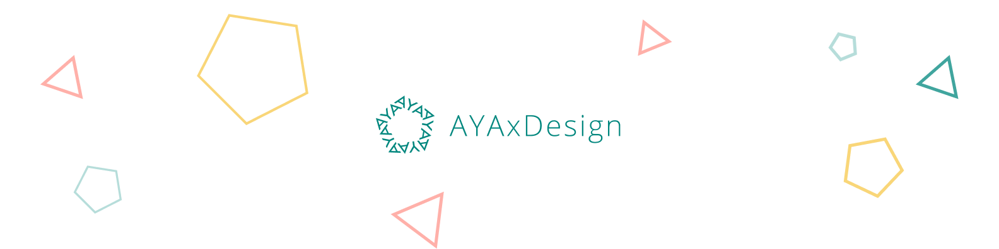

# Hello there, I‘m Aya! 🤗
I'm a media computer science student, passionate to learn more about frontend developement and opensource projects. I thoroughly enjoy immersing myself in new projects, experimenting with code, and staying updated with the latest trends in the tech industry. Currently, I am pursuing a degree in Media Computer Science, where I strive for excellence in implementing clean and concise solutions.

## About me
- 👩🏻‍💻 Studying <a target="_blank" rel=”noreferrer” href="https://www.hs-rm.de/en/faculties/design-computer-science-media/degree-programs/media-computer-science-bsc">**Media Computer Science**</a>
- 🌱 Currently learning to code
- 💡 Interested in Frontend and Backend Developement
- 👩🏻‍🎨 Worked 7 years as UI/UX Designer